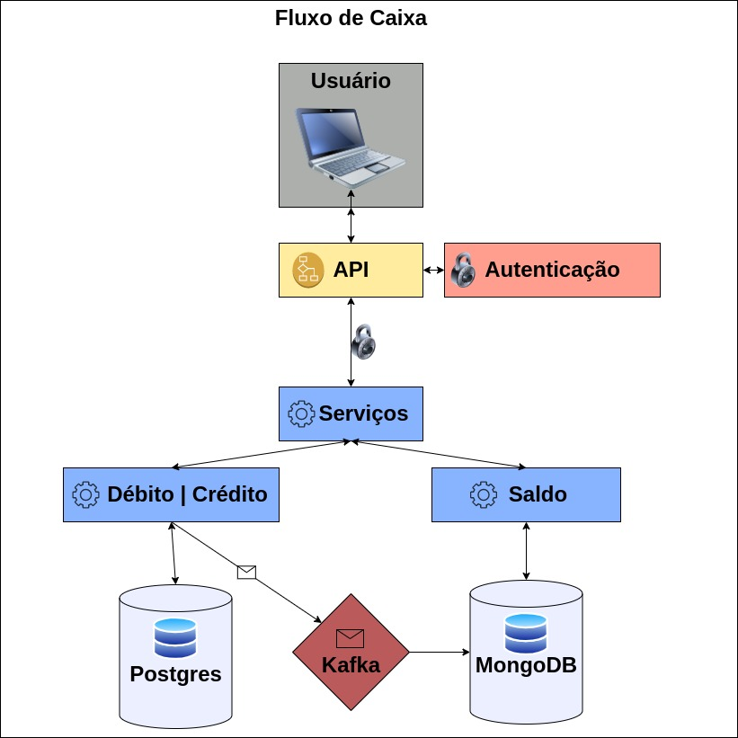
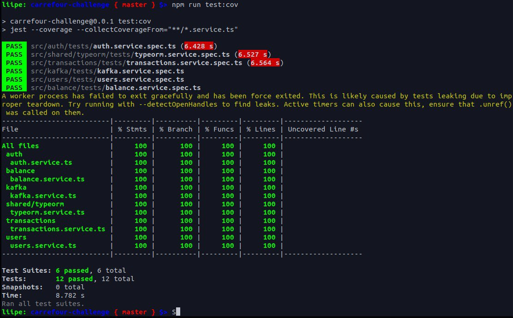

<p align="center">
  <a href="http://nestjs.com/" target="blank"></a>
</p>

[circleci-image]: https://img.shields.io/circleci/build/github/nestjs/nest/master?token=abc123def456
[circleci-url]: https://circleci.com/gh/nestjs/nest

## Descrição

Seja bem vindo ao repositório do Projeto de <b>Fluxo de Caixa</b> para o desafio técnico da vaga de Desenvolvedor Backend Senior no Carrefour.

O objetivo desta aplicação é realizar o controle de lançamentos de crédito e débito de um comércio como também as informações de saldo consolidado dos mesmos.

- Esta aplicação segue um padrão de microserviço utilizando o framework NestJs e Messageria com Kafka.

- Decorators, Strategies e Guards como <b>Design Patterns</b>.

- Arquitetura MVC

- Testes Unitários

- Autenticação via token JWT

Outras bibliotecas utilizadas:

- Helmet
- Bcrypt

Banco de dados:

- PostgreSQL
- MongoDB

---

# Desenho do Projeto:



---

# Para iniciar o projeto é necessário obter o <strong>Docker</strong> na sua máquina, e para usá-lo é necessário o <strong>Postman</strong>

- ### Faça o download do Docker no site oficial <a href="https://www.docker.com/get-started/" target="_blank">Docker</a>

- ### Faça o download do Postman no site oficial <a href="https://www.postman.com/downloads/" target="_blank">Postman</a>

---

# Organização via Trello

---

### Foi utilizado a ferramenta Trello para planejamento e organização do desenvolvimento

- <a href="https://trello.com/b/hDO2Pc07/carrefour-challenge" target="_blank">Trello</a>

---

# Instalação

### Definir um arquivo .env (Há um arquivo .env.example que já possui as infos de teste para o projeto apenas o renomeie para .env)

### Toda a instalação de bibliotecas, node, banco de dados, etc, será orquestrado pelo docker, basta utilizar o terminal ou shell e navegar até a pasta do repositório clonado do projeto e produzir o seguinte comando:

```bash
$ docker-compose up --build
```

## Teste de Rotas

### Para testar as rotas, basta importar o arquivo Carrefour-Challenge.postman_collection.json no Postman, lá haverá as seguintes rotas:

- Login

- CreateTransaction

- GetBalance

### Rotas previamente configuradas, atente-se apenas obter o token na rota de Login e enviá-lo nas requisições de criação e obtenção do saldo consolidado.

---

# Documentação das Rotas:

- ## Login (O usuário é criado na inicialização do banco, utilize o usuário do exemplo):

  - Método: POST
  - Body: {
    "email": "fulano@example.com",
    "password": "senhafulano" }

  - Response (200): {"token": "eyJhbGciOiJIUzI1NiIsInR5cCI6IkpXVCJ9.e..."}
  - Response (401): {
    "statusCode": 401,
    "message": "Credenciais Inválidas.",
    "error": "Unauthorized"
    }

- ## CreateTransaction:

  - Método: POST
  - Body: {"accountId: number, "type": "crédito" || "débito", "amount": number, "description": "string"}

  - Response (201): Created
  - Response (401): {
    "statusCode": 401,
    "message": "Credenciais Inválidas.",
    "error": "Unauthorized"
    }
  - Response (400): {
    "statusCode": 400,
    "message": [
    "Erro na requisição"
    ],
    "error": "Bad Request"
    }

- ## GetBalance:

  - Método: GET
  - Body: {"accountId": number, "date": "DD/MM/YYYY"}

  - Response (200): {
    "accountId": 100,
    "date": "2023-05-15T00:00:00.000Z",
    "amount": 801.05
    }

  - Response (400): {
    "statusCode": 400,
    "message": [
    "Erro na Requisição"
    ],
    "error": "Bad Request"
    }

  - Response (401): {
    "statusCode": 401,
    "message": "Credenciais Inválidas.",
    "error": "Unauthorized"
    }

---

---

# Cobertura de Testes em Todos os Serviços



```bash
# test coverage
$ npm run test:cov
```
